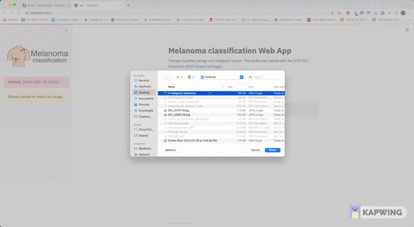

# A Web app for malignant melanoma classification with deep learning

## Demonstration



## Purpose

As part of the X-HEC Data science master program, we are asked to carry out a personal
project. I decided to do mine on Melanoma classification based on a past Kaggle competition
organized by the Society for Imaging Informatics in Medicine (SIIM). The competition
consists in classifying picture of benign and malignant melanoma.

This dataset is made up of more than 43,000 images coming from 2,056 unique patients.
The model challenge (as in most medicine challenge) consists in handling the class
imbalance issue (1.7% of positive class).

To emphasize on the critical need for large-scale, cheap and ready-to-use ML models
to detect skin cancer, it is worth noting that **1 person dies of melanoma every hour
in the US** (source: skincancer.org) and that **melanoma is the 2nd most common form of cancer for
young people aged 15-29**.

In particular, this repository contains a Streamlit app that embarks a trained deep learning model
to infer the malignancy of a mole. It is the main deliverable of this repo.

## Structure of the repo

This repo is divided into three main sections:

- `exploration`: the exploration folder that contains all the notebooks used to carry out
  an EDA and get familiar with the data.

- `modeling`: contains all the preprocessing, feature engineering and training scripts used
  to train the model.

- `deployment`: contains the Streamlit app that embarks the deployed model.

## Disclaimer

Warning: This machine learning model has not gone through an extensive bias and performance
review process, and is not intended to be used in production. Any use of this model as
well as subsequent diagnosis shall be taken with extreme caution. The author declines any
responsibility in case of any misdiagnosis and detrimental consequences to a patient health.
Patients should always consult a qualified practitioner.

## How to use

The safest way to ensure the app is working is to run the app within a Docker container.

To build the Docker image, run:

```
docker build -f Dockerfile -t <YOUR_USERNAME>/melanoma_web_app .
```

Then, to launch the app:

```
docker run -p 8501:8501 <YOUR_USERNAME>/melanoma_web_app .
```

## Available models

After trying and tuning many architectures, I decided to focus on the 3 following architectures:

| Model name      | # of params | Image size | OOF CV AUC |
| --------------- | :---------: | :--------: | ---------: |
| EfficientNet-B3 |     12M     |    384     |      0.905 |
| EfficientNet-B5 |     28M     |    384     |      0.902 |
| EfficientNet-B3 |     12M     |    512     |      0.892 |
| EfficientNet-B5 |     28M     |    512     |      0.905 |
